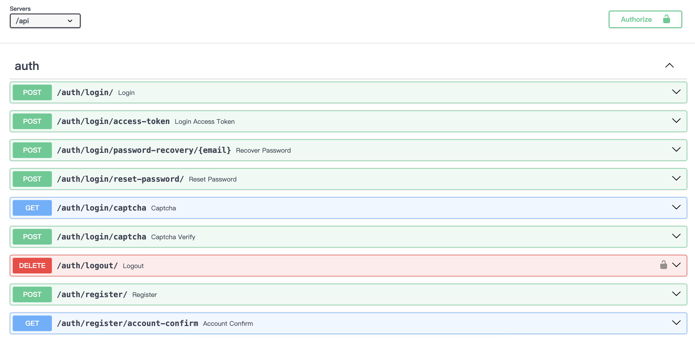
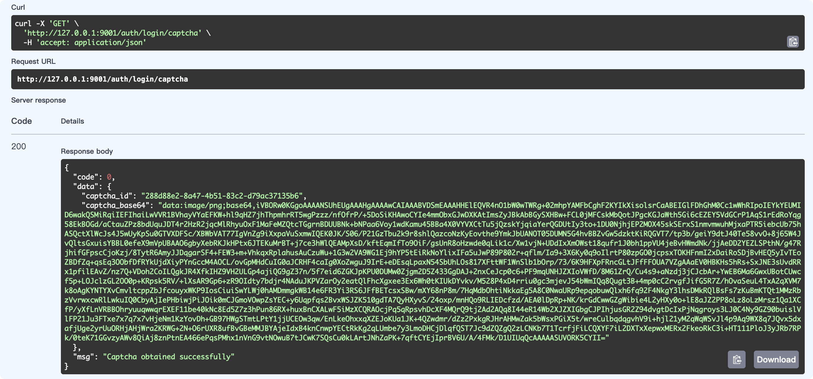

包含了用户管理、组管理、认证、验证码、Celery任务、异步数据库读写、Cache等功能，帮助你快速启动项目！






## 1. 环境配置

## 1.1 pipenv

推荐使用这种方式！

```sh
pip install pipenv
pipenv install
```

### 1.2手动安装

```sh
# fastapi
pip install fastapi
pip install "uvicorn[standard]"
pip install 'python-jose[cryptography]' 'passlib[bcrypt]' 'pydantic[email]' pydantic-settings python-multipart

pip install emails jinja2 Pillow fastapi-limiter

# cache
pip install "aiocache[redis,memcached]"

# celery
pip install 'celery[redis]'

# database
pip install tortoise-orm aerich
```

## 2. 启动项目

```sh
# 初始化数据库
aerich init -t  app.core.init_app.TORTOISE_ORM

# aerich init-db
# aerich migrate
# aerich upgrade 

# redis-server 需保证启动

PYTHONPATH="./" celery -A app.core.celery worker -l INFO

uvicorn app.main:app --reload --reload-dir app/ --port 8001 
# 如果使用代理服务器可能需要配置root-path
# uvicorn app.main:app --reload --reload-dir "app/" --port 6001 --root-path "/api"
```


## 3. 添加app

注册路由

core/init_app.py

```py
def register_routers(app: FastAPI):
    app.include_router(auth_router, prefix='/api/auth')
    app.include_router(users_router, prefix="/api/users")
    app.include_router(groups_router, prefix="/api/groups")
    app.include_router(system_router, prefix="/api/system")
```

注册Model

core/config.py
```
    APPLICATIONS: List[str] = [
        'app.applications.users',
        'app.applications.groups',
        'app.applications.system',
        'app.applications.jira_gpt',
    ]
```
